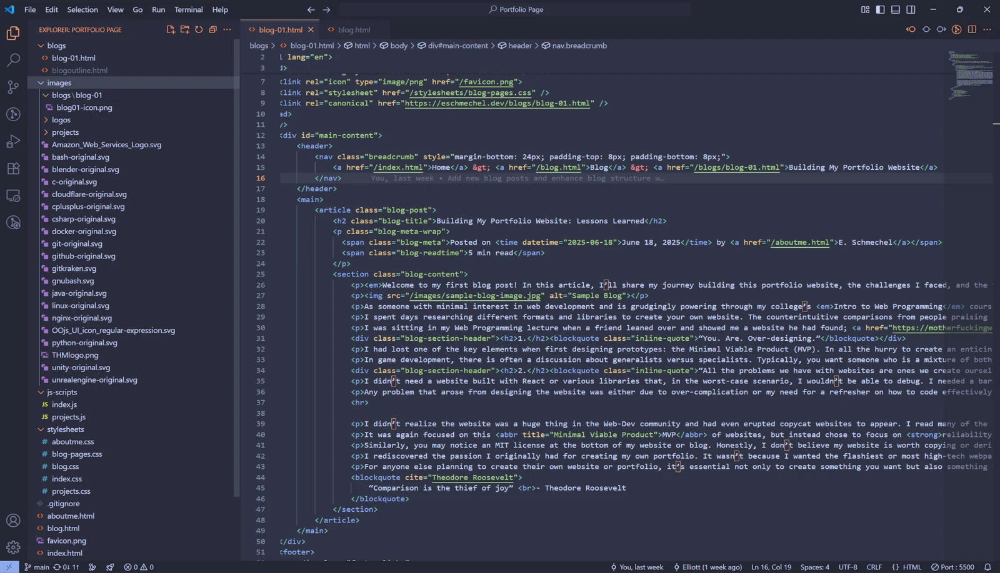

*Welcome to my first blog post! In this article, I’ll share my journey building this portfolio website, the challenges I faced, and the tools I used along the way.*

As someone with minimal interest in web development and grudgingly powering through my college’s *Intro to Web Programming* course, I knew sooner rather than later I needed to create a portfolio. With just one week of experience with HTML in a high school marketing course, I decided to go all in.

## Part 1: Planning

I spent days researching different formats and libraries to create your own website. The counterintuitive comparisons from people praising React to those dismissing Angular. I tried to get a better understanding by watching YouTube **How-To**’s but quickly felt like I was back in [Tutorial hell](https://www.wbscodingschool.com/blog/what-is-tutorial-hell-how-to-get-out).

I was sitting in my Web Programming lecture when a friend leaned over and showed me a website he had found; [motherfuckingwebsite.com](https://motherfuckingwebsite.com). Despite its overall satirical tone, it raised some valid points.
## 1. <blockquote style="display: inline;"> “You. Are. Over-designing.”</blockquote>
I had lost one of the key elements when first designing prototypes: the Minimal Viable Product (MVP). In all the hurry to create an enticing portfolio, I had overcomplicated my original design.

In game development, there is often a discussion about generalists versus specialists. Typically, you want someone who is a mixture of both, being good at their specialty but also knowledgeable about the other processes, to remain flexible. However, in my plight to try to showcase my desire for growth and love for Computer Science, I instead forced myself into a generalist for all of <abbr title="Computer Science">CS</abbr>. As a C++ developer, I didn’t need to showcase my skills in Front-End as it wouldn’t be something I would ever work with.

## 2. <blockquote style="display: inline;"> “All the problems we have with websites are ones we create ourselves.”</blockquote>
I didn’t need a website built with React or various libraries that, in the worst-case scenario, I wouldn’t be able to debug. I needed a bare-bones website that conveyed information and character but was simplistic enough for me to edit and change whenever required.

Any problem that arose from designing the website was either due to over-complication or my need for a refresher on how to code effectively.

I didn't realize the website was a huge thing in the Web-Dev community and had even led to copycat websites to appear. I read many of the copycats' similar satirical articles, which had troves of actual solid advice. My favourite came from [perfectmotherfuckingwebsite.com](https://perfectmotherfuckingwebsite.com/).

It was again focused on this <abbr title="Minimal Viable Product">MVP</abbr> of websites, but instead chose to focus on **reliability and accessibility**. The point stood that <u>if it takes less than 5 minutes for me to make the website more accessible, it's worth it</u>.  If I spend hours creating a simple banner to fly across the screen for style, but then **it isn't accessible, it's a waste of time**. Regardless of whether anyone used any of the accessibility features, if I didn't learn best practices, then I wasn't truly learning; I was regurgitating.

Similarly, you may notice an MIT license at the bottom of my website or blog. Honestly, I don't believe my website is worth copying or deriving work from, nor do I believe anyone will ever do so; however, the point remains that I wanted to create a website that was accessible and had the proper practices in mind.

I rediscovered the passion I originally had for creating my own portfolio. It wasn't because I wanted the flashiest or most high-tech webpage. I wanted something that I could be proud of, and that would meet my needs.

<blockquote cite="Theodore Roosevelt">“Comparison is the thief of joy”  - Theodore Roosevelt
</blockquote>

For anyone else planning to create their own website or portfolio, it's essential not only to create something you want but also something that's uniquely yours and makes you proud.
