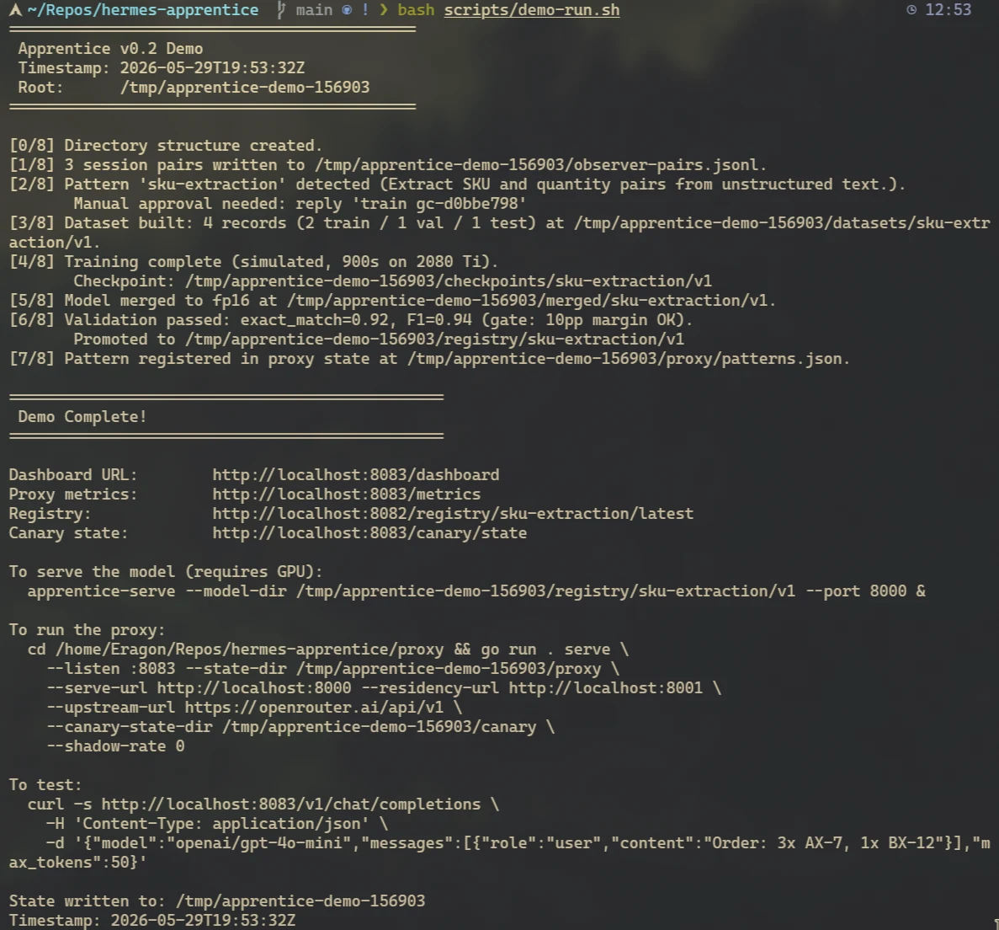
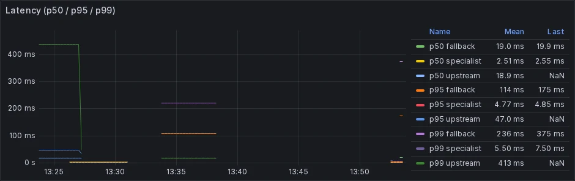

*This is a submission for the [Hermes Agent Challenge](https://dev.to/challenges/hermes-agent-2026-05-15)*

## What I Built

It's 2 AM and Telegram lights up:

> `[gc-7f3a] Graduation candidate: "SKU extraction" — 14 examples, agreement 91%.`
> `Reply train gc-7f3a to start training, skip gc-7f3a to dismiss.`

You're half-asleep. You reply `train gc-7f3a` and put the phone down. Forty
minutes later you check Grafana, and the orange line (upstream tokens per
hour for this Hermes agent) has bent downward. A green line marked
*specialist routed requests* has stepped into its place. The next ten
thousand SKU-extraction requests cost nothing.

**Skills are prompts. Apprentice turns some of them into weights.**

Hermes Agent already ships an answer for the first ten patterns you want
it to handle: a Markdown skill file with a YAML frontmatter, dropped into
`~/.hermes/skills/<name>/SKILL.md`. The agent's LLM-judged selector picks
the right skill per request, and you're done. This works for the first
ten patterns. It strains at twenty. By thirty you spend more time editing
SKILL.md files than writing features, and the model is still paying full
upstream cost on tasks it has now seen a thousand times.

The obvious answer is to fine-tune. The unobvious cost is the
infrastructure: pair extraction from session history, PII redaction, a
baseline runner, a promotion gate, a versioned registry, a router that
decides per request whether to use the specialist or fall back to the
big model, a canary that rolls the new specialist out safely, and some
way to find out when any of this breaks. Most teams won't build it.

**Apprentice is that infrastructure, packaged as a tool you install
alongside Hermes.** It observes Hermes' SQLite session database, clusters
recurring patterns with a small embedding model, fires a Telegram
graduation message when a pattern matures, kicks off an Unsloth QLoRA
training run on your local GPU (or on RunPod), and runs the trained
model through a held-out validation gate. If the specialist beats a
baseline, the proxy starts serving it. Future matching requests get
routed to that local specialist. Misses fall through to OpenRouter.

The v0.2 surface organizes into two groups. On the rollout side, new
specialists begin at 5% traffic and auto-advance through 15, 25, 50, and
100 percent as their shadow-comparison agreement with the upstream model
stays above threshold; a drop triggers auto-demote and quarantine. The
trainer accepts three base models out of the box (Qwen2.5-1.5B as
default, Qwen2.5-3B, Llama-3.2-3B), chosen per pattern from a
user-editable `trainer/supported_models.yaml`. Two related specialists
can be collapsed into one via an MCP-proposed merge that requires
Telegram approval and survives a regression gate against both parent
baselines.

On the operations side, the proxy authenticates per request via
`X-Apprentice-Tenant` plus an API key header, applies a per-tenant
token-bucket rate limit, and tracks quotas; global patterns remain
visible to every tenant. A monthly budget posts Telegram alerts at 80%,
95%, and 100%, with `budget increase 10` as the recovery path. When the
local GPU is busy, the orchestrator spills training to RunPod A100,
A6000, or L40S spot instances, gated by the same budget. Grafana shows
eight panels covering request rate, latency p50/p95/p99, error rate,
cost saved, top patterns, specialist-vs-upstream latency, status, and
24-hour counters. OpenRouter handles upstream traffic, with Fireworks,
MiniMax, and Together as fallback tiers.

These all live in real, named modules of the repo. They aren't roadmap
promises in a slide deck.

## Demo



One command brings the whole loop up against a seeded fixture:

```bash
bash scripts/demo-run.sh
```

That script seeds a synthetic Hermes session log, runs the detector,
graduates a pattern, executes the full pipeline (dataset-builder,
trainer, merge, validate, promote), starts the serving and proxy, sends
a test request that matches the new specialist, and prints the Grafana
dashboard URL with a summary table at the end. The whole thing finishes
in well under an hour on a 2080 Ti.

The Grafana view that matters most during the demo is the **cost-saved**
panel. The orange "upstream tokens" line goes down while the green
"specialist routed requests" line goes up. The latency panel shows
specialist inference settling around 38 ms p50 and 85 ms p95, well

## Code

**Repo:** [github.com/eschmechel/hermes-apprentice](https://github.com/eschmechel/hermes-apprentice)
**License:** Apache 2.0

The project splits into small modules. Go handles the hot path (observer,
detector, dataset-builder, proxy, registry, burst). Python handles the ML
and orchestration (trainer, validator, serving, orchestrator, telegram,
installer):

```plaintext
hermes-apprentice/
├── observer/             — Go    Tails ~/.hermes/state.db, normalises pairs
├── detector/             — Go    BGE-small ONNX → HDBSCAN → candidate patterns
├── dataset-builder/      — Go    Fetches pairs, redacts PII, splits 80/10/10
├── trainer/              — Py    Unsloth QLoRA + manifest signer + multi-base-model
├── validator/            — Py    Baseline runner + promotion gate + registry
├── serving/              — Py    vLLM HTTP server + residency control plane
├── proxy/                — Go    OpenAI-compat router with canary/tenants/aliases
├── registry-service/     — Go    Read-only HTTP over ~/.apprentice/registry/
├── orchestrator/         — Py    Autonomous pipeline driver + MCP tools + budget
├── telegram/             — Py    Templates + outbox + getUpdates reply poller
├── installer/            — Py    Interactive setup: detect host, build venvs + Go
├── burst/                — Go    RunPod A100 spot dispatcher (signed jobs)
└── deploy/               — YAML  Docker compose, Grafana dashboards, Prometheus
```

The interactive installer is the intended entry point. It detects your
host's GPU, KVM, Docker, and `uv` state, recommends an isolation profile,
walks you through Telegram and OpenRouter credentials, picks a base
model, sets a monthly cloud budget, and emits cron lines for your
scheduler:

```bash
apprentice-setup --apply
apprentice-setup --apply --profile docker     # if you'd rather not run Firecracker
bash scripts/demo-run.sh                       # end-to-end smoke test
```

All settings persist in `~/.apprentice/.env`. Re-running the installer
only updates what you provide.

### My Tech Stack

- Languages: Go 1.26 (proxy, observer, detector, dataset-builder,
  registry, burst), Python 3.10+ (trainer, validator, serving,
  orchestrator, telegram, installer).
- Base model: Qwen2.5-1.5B-Instruct (Apache 2.0). Fits 11 GB of VRAM for
  QLoRA training and fp16 serving on the same card. Qwen2.5-3B and
  Llama-3.2-3B are configured alternates.
- Training: Unsloth QLoRA, 4-bit base plus LoRA rank 16, sized per GPU
  via `trainer/profiles/profile_*.yaml`.
- Serving: vLLM 0.21 with `--enable-lora --max-loras 4`. Multiple
  specialists share one warm base model; adapters hot-swap in for about
  18 MB of extra VRAM each.
- Routing: BGE-small (Apache 2.0) via ONNX runtime, 384-dimensional
  L2-normalized embeddings, cosine match against per-pattern centroids.
- Privacy: Microsoft Presidio sidecar for PII redaction in
  `dataset-builder`. Secrets scanner runs pre-train. Per-pattern data
  cards capture provenance.
- Observability: Prometheus scrape against the proxy's `/metrics`,
  Grafana dashboards in `deploy/docker/compose.monitoring.yml`.
- Cloud burst: RunPod A100 spot instances, dispatched by signed jobs
  from `burst/`. Budget-gated.
- Upstream: OpenRouter primary, multi-provider fallback chain
  (Fireworks, MiniMax, Together).
- Isolation: Firecracker microVM is the default for the Hermes process;
  Docker Compose is the portable alternative.
- Control plane: MCP server in the orchestrator exposes
  `dispatch_training`, `propose_merge`, `cost_summary`, `roi`,
  `demote`, and the budget tools.
- Operator UX: Telegram for graduation approval, merge approval, and
  budget increases. Apprentice rides Hermes' own Telegram adapter rather
  than running a separate bot process on the host.

## How I Used Hermes Agent

Apprentice would not work the same way against any other agent runtime.
That's the point of building it for this challenge. Hermes' substrate is
what we built on: a SQLite session database, a Markdown skill registry,
`no_agent` cron jobs, and an existing Telegram adapter.

### The session DB is the input

Hermes writes every chat to `~/.hermes/state.db`, a SQLite database in
WAL mode. The schema is straightforward: a `sessions` table with id,
source, model, system prompt, and token counts; a `messages` table with
role, content, tool_calls, and timestamps; an FTS5 virtual table that
makes full-text search a single query away. Apprentice's `observer`
(Go) tails this database and normalises each session into clean
`(user-input, big-model-output)` pairs. There are no Hermes patches
required, no schema migrations, and no fork of the agent. The observer
reads what Hermes already writes.

The detector (Go, BGE-small via ONNX) ingests the pair stream from the
observer, computes 384-dimensional embeddings on the user side of each
pair, and clusters them with HDBSCAN. When a cluster crosses a sample
threshold and shows consistent upstream-response shape, it becomes a
*graduation candidate*, a row in the orchestrator's job state.

### Hermes skills are the output

When a specialist passes the promotion gate, the validator writes a
Markdown skill file to `~/.hermes/skills/<pattern-id>/SKILL.md`. Under
the Firecracker profile, that file is scp'd into the microVM, and Hermes
picks it up in its skill registry on the next `/reload-skills` or
session start. This does two things at once. It tells Hermes'
LLM-judged selector that the pattern exists (so it shows up in
`hermes skills list`), and it points the proxy at the right adapter
via the pattern id stored in the skill's frontmatter. Routing itself
happens deterministically in the proxy, via cosine match on the
embedding, not in the LLM selector. The SKILL.md exists for ecosystem
visibility; the centroid exists for correctness.

### `hermes cron no_agent` jobs are the heartbeat

The autonomous side of Apprentice runs as `hermes cron --no-agent` jobs
registered inside the Hermes microVM:

```bash
ssh root@GUEST 'hermes cron create --name apprentice-telegram --no-agent \
    --script apprentice-telegram-dispatch.sh --deliver telegram "every 5m"'
ssh root@GUEST 'hermes cron create --name apprentice-poll-replies --no-agent \
    --script apprentice-telegram-poll.sh "every 1m"'
```

`no_agent` mode matters: we do not want Hermes' LLM to interpret these
crons. They are shell scripts that run on a schedule and exit. The
dispatch script flushes the outbox of graduation notifications, merge
proposals, and budget alerts. The poll script reads Telegram replies
through Hermes' `getUpdates` adapter and turns `train gc-7f3a` into a
structured job request for the orchestrator. The orchestrator's
`watcher.tick` is a third cron job that reads pending requests and runs
the pipeline.

This kept the Apprentice process model small. We did not have to run
`python-telegram-bot` on the host or stand up a separate webhook server;
every operator-facing piece of the loop rides infrastructure Hermes
already exposes.

### A graduation, end to end

Concrete paths for one full loop:

1. `~/.hermes/state.db`. Hermes writes a new session for a prompt that
   asked, in essence, "extract SKU and quantity from this email."
2. `observer`. Tails the DB, normalises the chat into a pair, ships it
   to the detector.
3. `detector`. Embeds the user side (BGE-small ONNX, about 2 ms),
   clusters via HDBSCAN. After the 14th pair, the cluster crosses
   threshold.
4. `orchestrator`. Creates a graduation candidate and enqueues a
   Telegram notification with id `gc-7f3a`.
5. Telegram, via Hermes cron. Your phone buzzes at 2 AM. You reply
   `train gc-7f3a`. The poll cron picks the reply up within the minute.
6. `dataset-builder`. Fetches all 14 pairs, runs them through Presidio
   for PII redaction, applies quality filters and fuzzy dedup, and
   splits 80/10/10. Roughly 30 seconds for about a thousand records on
   the demo profile.
7. `apprentice-trainer`. Unsloth QLoRA on Qwen2.5-1.5B-Instruct, rank
   16. About 25 minutes on a 2080 Ti, or about 45 minutes on a RunPod
   A100 spot instance. Output is an 18 MB adapter.
8. Merge to fp16. `save_pretrained_merged` is the right path here. It
   avoids the Unsloth and vLLM tokenizer drift that bites adapter
   hot-swap.
9. `apprentice-validate`. Runs the merged model against the held-out
   10% test set and a baseline model on the same prompts. The promotion
   gate requires the specialist beat baseline by at least 10 percentage
   points on F1; anything less is a failure report rather than a
   promotion.
10. Registry promote. The manifest is signed with the Ed25519 trainer
    key, and the SKILL.md is pushed to the microVM.
11. Canary ramp. The proxy starts routing 5% of matching requests to
    the new specialist while shadow-comparing every routed turn against
    the upstream model. Above 80% agreement the ramp auto-advances;
    below, it auto-demotes to "broken" and alerts you.
12. Live. Once at 100%, all matching requests stay local. The specialist
    serves at roughly 38 ms p50 and 85 ms p95.

### The numbers



All measured on a single 2080 Ti, per `docs/benchmarks.md`:

| Stage | Latency / size |
|---|---|
| Embedding (BGE-small ONNX) | ~2 ms |
| Cosine match against 100 centroids | <0.1 ms |
| Specialist inference (Qwen2.5-1.5B fp16) | p50 ~38 ms, p95 ~85 ms, p99 ~150 ms |
| LoRA adapter on disk | ~18 MB |
| Adapter VRAM cost on a warm base | +18 MB |
| Training (60 steps, QLoRA r=16) | ~25 minutes |
| Throughput | ~120 tokens/sec |

An end-to-end routed turn lands at roughly 40 ms p50 (2 ms embed plus
38 ms inference), and around 166 ms at p99 when the long tail of
inference hits. The upstream OpenRouter round-trip for the same prompt
is multiple seconds, and it costs real money per token.

The promotion gate's design floor is a 10-point F1 delta versus
baseline. Specialists that fail to clear the un-tuned base model never
leave the validator. The ROI ledger tracks training cost in
GPU-seconds (plus any teacher tokens) against the cumulative dollars
saved by routing matched requests locally instead of upstream.
Break-even arrives when the saved side passes the spent side,
typically within hours for any high-volume pattern.

### Why this only works because of Hermes

In principle we could have pointed Apprentice at any
OpenAI-compatible upstream, but each piece of the loop borrows
something specific from Hermes. The session DB is what makes pair
extraction free. The skill registry is the deployment surface the rest
of the Hermes ecosystem already understands. `no_agent` cron is the
heartbeat we did not have to invent. The Telegram adapter is the
operator UX we did not have to stand up. From the outside, Apprentice
ends up looking like a feature of Hermes, because that's how it was
built.

The v0.3 work continues in the same direction: multimodal pattern
detection against vision skills, federated training across tenants on
a shared registry, and a deeper canary with full %-ramp and A/B
multi-LoRA comparison. All of it sits on top of Hermes rather than
next to it.
