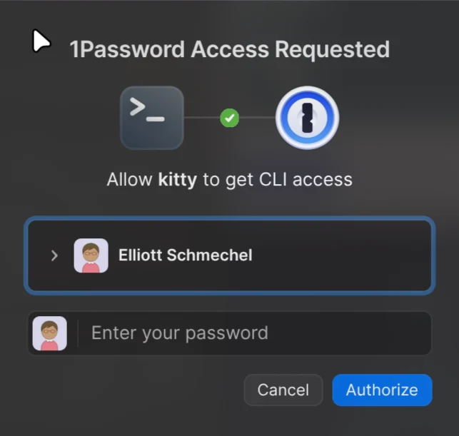
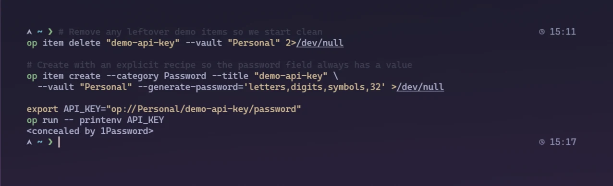

I still remember sending API keys to my friend across Discord during hackathons. For years, everything sensitive I owned lived in a file. SSH keys in `~/.ssh`, API tokens in `.env`, and the odd password in Notepad. That works right up until you set up a new laptop, or open a project and can't tell which `.env` file holds the live key.

1Password is what replaced all of that; it's the tool from this series I'd least want to give up. The passwords are almost beside the point. What changed how I work is how a developer-first password manager fixes the problems in your workflow you never see.

This is the first post in a short series on the tools I lean on, and one idea runs through all of them: stay fluid across a pile of machines and operating systems, and keep it all under my control.

## What "developer-first" actually means

A normal password manager stores logins, autofills them in your browser, and ends there. A developer-first one handles everything beyond that: SSH keys, API tokens, database URLs, and `.env` contents. It gives you a CLI to inject those into your shell at runtime, and it can act as an SSH agent so your keys never sit on disk at all.

Here's how I actually use it.

## SSH keys live in the vault, not on disk

You generate or import an SSH key as a vault item. 1Password runs an SSH agent, and you point your SSH client at its socket. On my Arch laptop, that's one block in `~/.ssh/config`:

```ssh-config
Host *
    IdentityAgent ~/.1password/agent.sock
```

After that, `ssh homelab` or `git push` just works whenever I unlock the vault. The private key is never a file in `~/.ssh`. Set up a new machine, and there's no key to copy over: sign in, and the agent already has every key you own.




Unlocking is as simple as Face ID or a master password. Either way, nothing on the machine holds the keys at rest.

## Secrets get injected at runtime with `op run`

The problem this solves is the plaintext `.env` file. Instead of real values, my env files hold references that point into the vault:

```bash
# .env
DATABASE_URL=op://Homelab/postgres/connection_string
STRIPE_KEY=op://Dev/stripe/test_key
DISCORD_TOKEN=op://Dev/mybot/token
```

Then I launch the app through `op run`:

```bash
op run --env-file=.env -- go run ./cmd/server
```




`op` resolves each `op://vault/item/field` reference at launch, sets the real values as environment variables for that subprocess only, and they vanish when the process exits. The references are just pointers, so the file is safe to commit, although between you and me, I might still gitignore it. Whether that's out of habit or fear, I don't know.

## Signed commits without babysitting a GPG key

Since the SSH key already lives in the vault, you can point Git at it for SSH commit signing:

```bash
git config --global gpg.format ssh
git config --global user.signingkey "ssh-ed25519 AAAA...you@host"
git config --global commit.gpgsign true
```

Every signed commit prompts for verification, and there's no GPG key to manage or lose. If you've never turned on commit signing because it's a hassle, this turns it into three shell commands.

## Keys off disk is a real security win

There's a security payoff on top of the convenience. Several of the npm supply chain compromises over the past year worked the same way: a malicious package runs a post-install script that greps your home directory for credentials in clear text (`~/.ssh`, `~/.aws`, `~/.config`) and exfiltrates whatever it finds.

If your private keys and cloud creds live in an encrypted vault behind a biometric unlock, that script finds nothing. It doesn't make you immune, of course: a running unlocked agent can still be asked to sign things, and malware inside your processes is still bad news. But it deletes the easiest vector of attack.

There's a newer version of the same problem, and the same fix covers it. AI coding agents `cat` your `.env` constantly, usually just to understand the project, and every one of those reads is a chance for a live key to end up in a prompt, a log, or a model provider's servers. Because my `.env` holds `op://` references instead of real values, the worst an agent finds there is a pointer. It's useless without the vault, so the file can leak, and the keys stay put. The secret it went looking for was never in the file.

## Should you use 1Password? What about Bitwarden?


Now, I'm not trying to float 1Password as the holy grail. I use it every day, and honestly, Bitwarden might be the better call for you. For a lot of people, it is.

Both now cover the core developer workflow. That's newer than you might expect. Bitwarden only shipped a built-in SSH agent in early 2025. Before that, storing SSH keys in Bitwarden meant a community helper script. Now it's a first-class feature, it works well, and it even runs on self-hosted Vaultwarden with a feature flag. If you'd written Bitwarden off for missing things like this, that's outdated.

## What keeps me on 1Password

- `op run` and `op://` references are part of the base product. Bitwarden's runtime secret-injection equivalent lives in Bitwarden Secrets Manager, a separate product with its own pricing. Pulling a project's secrets into a local dev run is one less thing to think about, and I'm not paying for or running a second product to do it.
- The developer tooling is older and more finished: official SDKs for Go, Python, and JavaScript, service accounts for CI, and commit signing that works on the first try.
- Biometric unlock everywhere, and it's quick to set up across Windows, Linux, iOS, and supposedly macOS. (Anyone want to donate their M5 Pro?)

## Where Bitwarden is the better pick

- It's open source, and you can self-host the whole stack (Vaultwarden is a lightweight variant that speaks the same protocol). If "I want to own the box my secrets sit on" is a hard requirement, this is basically the answer you've got.
- The free tier is very usable, and premium runs about $10/year. 1Password has no free-standing tier and is subscription-only, though students can get a free year through the GitHub Student Developer Pack. For a non-student hobbyist, the price difference is real.
- Its SSH agent is free. 1Password's sits behind the paywall.

## Why I didn't self-host it

I run a homelab and will yell into the void about avoiding vendor lock-in, so the purist move here is obvious: self-host. Bitwarden's server is open source, or you can run Vaultwarden and own the whole thing. I looked at that and passed, for two reasons that both come back to the core of this post.

The first is uptime. The vault is the one service I can't afford to have go down, because it's the thing I need to log into everything else. My homelab is solid right up until a bad update or a power outage, and then I can't get into anything. Having the vault be someone else's uptime problem is worth every penny I spend.

The second is attack surface. Moving it to a VPS just swaps one box for another: now I've got a public-facing server to patch and lock down, which is the opposite of what a post about getting secrets off disk should recommend. Every service you self-host is a service you have to defend.

The cost argument that usually points people at Bitwarden doesn't apply to me right now either, because 1Password is free for a year through the GitHub Student Pack. So the math was simple: free and hosted by people whose whole job is keeping it up, versus a box I'd have to babysit.

The lock-in worry is still there, just bounded. The vault exports, and the developer-relevant bits (`op://` references) are plain text. If 1Password stops being worth it, or my free year runs out and I want to swap, moving off is a couple of grep commands. If your risk tolerance runs differently, Bitwarden is a completely reasonable place to land. The brand matters less than the habit: get keys and secrets out of files.

## If you do one thing

If you do one thing, make it this: move your keys into either manager and turn on the agent. It's the change you notice immediately, the first time you sign into a fresh machine and everything's already there. The `op run` workflow is the bigger win once you're set up, but the keys are what sell it. Give it a week and see if you'd go back.

Next up is the network all of this runs over. Getting my SSH keys onto a new machine is only half the trick. Tailscale is the other half.
